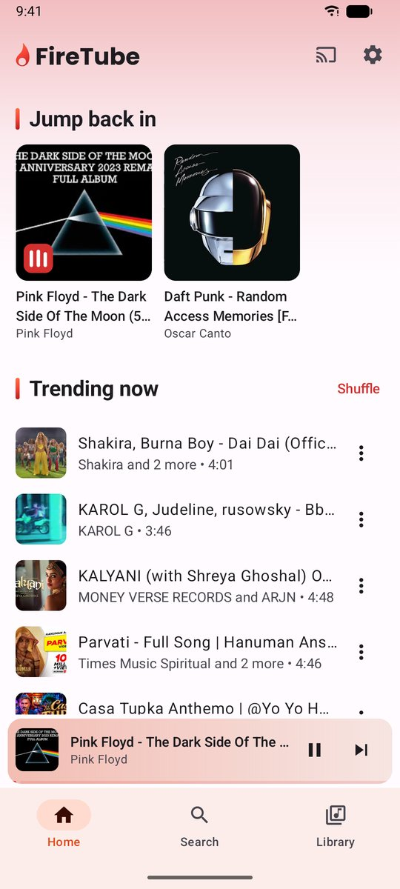
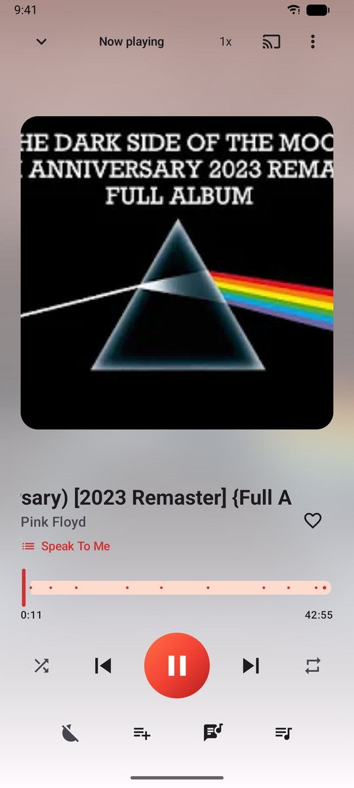
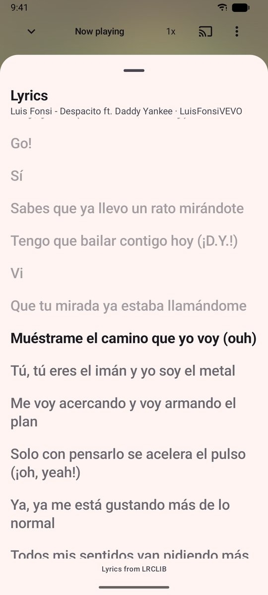
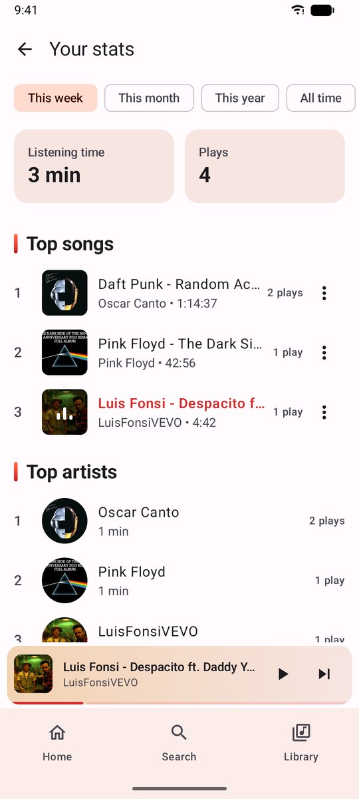
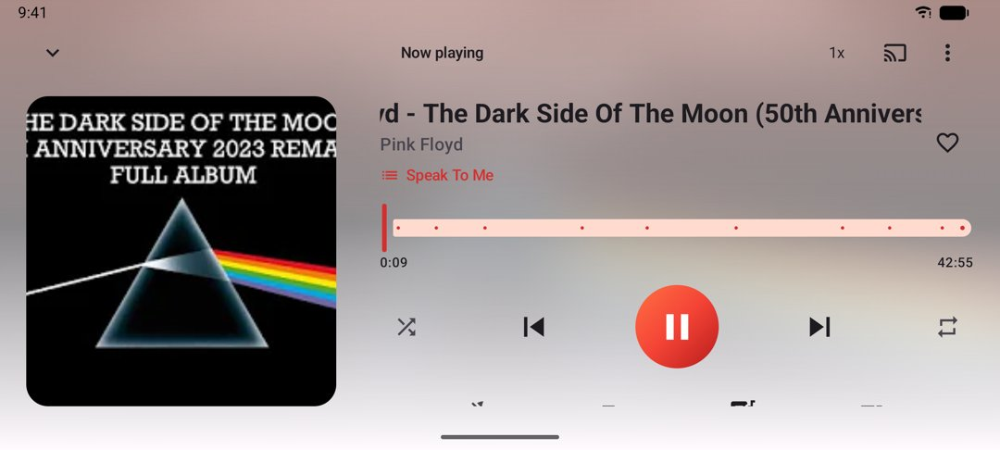

# FireTube 🔥

A free, open-source music player for Android, Android TV and Fire TV that plays songs from YouTube.
Official builds send crash reports (Firebase Crashlytics: device model and
crash details, no personal data), which you can turn off in Settings.

<p>
  
  
  
  
</p>


## Features

- **Search** songs, videos and playlists, with suggestions. You can also paste a YouTube link.
- **Radio-style autoplay:** when the queue runs out, related songs keep playing.
- **Background playback** with lock-screen, notification and headset controls, a home-screen widget, and a sleep timer.
- **Playlists and Favorites.** Drag to reorder, or import any YouTube playlist.
- **Your stats:** top songs and artists, listening time and when you listen, worked out on the device.
- **Offline downloads**, and a song cache so replays don't use data.
- **Even-out volume** between loud and quiet uploads.
- **Skip non-music sections** such as intros and talking, using [SponsorBlock](https://sponsor.ajay.app).
- **Synced lyrics** that follow the song (tap a line to jump there), from [LRCLIB](https://lrclib.net).
- **Chapters** for full albums, DJ mixes and live sets: see the current chapter and jump between them.
- **Equalizer** with presets and bass boost, **crossfade** between songs, and **playback speed** from 0.5x to 2x.
- **Android Auto**, including voice search, and **Chromecast**.
- **Android TV / Fire TV** and tablet layouts, with full D-pad support.
- **Optional Google sign-in** to sync your library, or backup and restore to a file.
- In **English, Spanish and Brazilian Portuguese**. Translations are welcome: copy `app/src/main/res/values/strings.xml` into a `values-xx` folder (or `values-xx-rYY` for a region, like `values-pt-rBR`) and add the language to `res/xml/locales_config.xml`.

## Install

Download the latest APK from **[Releases](https://github.com/PalmerinTek/firetube/releases)**.
FireTube updates itself, and it also works with [Obtainium](https://github.com/ImranR98/Obtainium).

FireTube isn't on Google Play: Play doesn't allow apps that play YouTube in the background.

## Support

FireTube is free and always will be. If it's become part of your day, you can
[leave a tip on Ko-fi](https://ko-fi.com/stevepalmerin). ☕

## Building

Requirements: JDK 17+ (Android Studio's bundled JBR works) and the Android SDK.

```sh
./gradlew assembleDebug              # APK in app/build/outputs/apk/debug/
./gradlew :core:extractor:test            # offline unit tests
./gradlew :core:extractor:test -Plive     # live tests against YouTube: search, resolve, stream
./gradlew testDebugUnitTest          # app unit tests
```

You don't need anything else to build. Without `app/google-services.json`, FireTube builds and runs with its
Firebase features turned off (crash reports, Google sign-in and sync). To enable them, add your own
Firebase project's config file.

## How it works

| Module | |
|---|---|
| `:core:extractor` | Pure JVM. Everything about talking to YouTube sits behind a small `StreamSource` interface, implemented with [NewPipeExtractor](https://github.com/TeamNewPipe/NewPipeExtractor). |
| `:app` | The Android app: Jetpack Compose UI, Media3 playback, and a Room database. |

- Songs are queued as `firetube://track/<videoId>`. Each one is turned into a stream URL just
  before it plays, and resolved again if YouTube rejects the URL. Because the queued URI stays the
  same, the song cache and downloads keep working after YouTube's URLs expire.
- The player is a Media3 `MediaLibraryService`, which also provides the notification, Android Auto
  and Chromecast support.
- For Chromecast, the phone relays the audio to the Chromecast, because YouTube's stream URLs are
  tied to the IP address that requested them.
- Your library is stored on the device. Signing in mirrors it to Firebase Realtime Database; that's optional.

### When songs stop playing
YouTube changes things without notice. A nightly **YouTube canary** workflow runs the live tests and
opens an issue when they fail. The fix is usually to bump `newpipeExtractor` in
`gradle/libs.versions.toml` to the latest
[NewPipeExtractor release](https://github.com/TeamNewPipe/NewPipeExtractor/releases).

## Contributing

Issues and pull requests are welcome; see [CONTRIBUTING.md](CONTRIBUTING.md).

## License

FireTube is licensed under the [GNU GPL v3](LICENSE). It builds on
[NewPipeExtractor](https://github.com/TeamNewPipe/NewPipeExtractor) (GPLv3),
[Media3](https://developer.android.com/media/media3), [SponsorBlock](https://sponsor.ajay.app) and
[LRCLIB](https://lrclib.net).

FireTube isn't affiliated with, endorsed by or sponsored by YouTube or Google.
